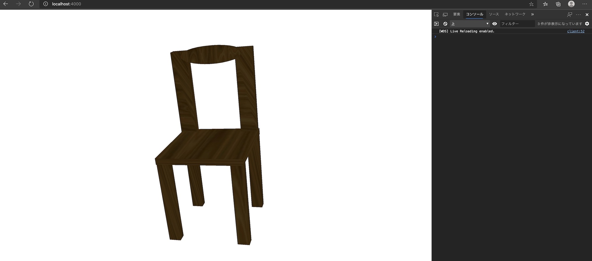

# A ES6 based example on three.js

  

# Background

以下、three.jsの記述になおすこと

Basic example for ES6 and three.js. Create scene, light, and import obj model.


# Usage

1. npm install  

```bash
npm install
```

2. run webpack-dev-server

```bash
$ npm start
```

3. Access the URL

http://localhost:4000

